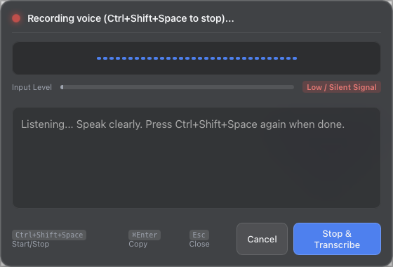
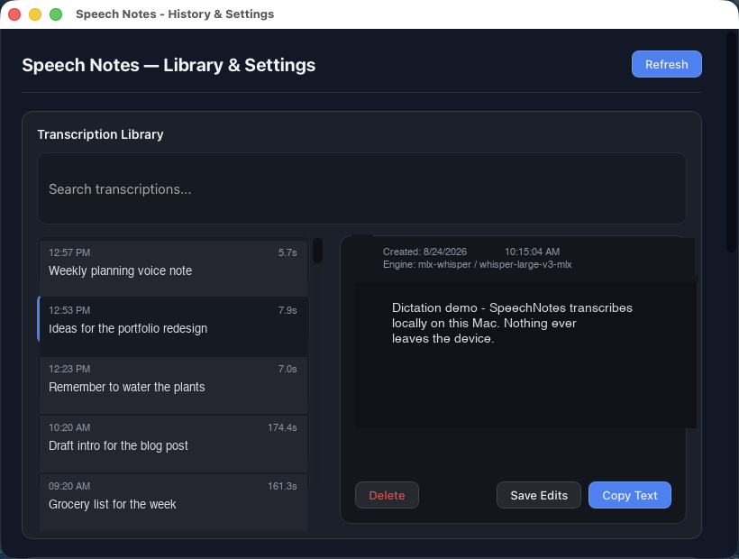

# SpeechNotes

Local-first, menu-bar English voice dictation for Apple Silicon Macs. Press a hotkey, speak, get text — transcribed by Whisper Large v3 entirely on your machine. No cloud transcription, no accounts, no telemetry.

<p align="center">
  &nbsp;&nbsp;
  
</p>

## How it works

1. On first launch, install the pinned 3.1 GB English transcription model from Settings
2. Press `Ctrl+Shift+Space` (or click the tray icon) anywhere in macOS
3. Speak — the live waveform and input level confirm capture
4. Press again — Whisper transcribes on-device in seconds
5. Review, edit if needed, copy to clipboard, paste anywhere

Every transcript is kept in a searchable local library (SQLite + full-text search). Raw audio is transient: it is deleted as soon as transcription completes.

## Features

- **On-device English transcription** with Whisper Large v3 via an MLX sidecar — the explicit one-time 3.1 GB download is SHA-256 pinned for integrity
- **Live recording feedback** — waveform, input level meter, silent-signal detection
- **Transcript library** — full-text search, inline editing, per-transcript engine provenance
- **Privacy by default** — transient audio, local-only processing, explicit permanent delete
- **Optional clipboard auto-copy** after each transcription (off by default)
- **Microphone picker** with a guided first-run permission flow

## Requirements

- Apple Silicon Mac running macOS 14 or later
- ~3.5 GB of disk space (app + model)
- Internet access for the explicit first-run model download; later transcription is offline
- Microphone permission on first launch

## Install

Download `Speech Notes_0.1.0_aarch64.dmg` from [Releases](https://github.com/felipauskas/speechnotes/releases), mount it, and drag the app to Applications.

On first launch, SpeechNotes opens Settings. Select **Install Model** and wait for the verified 3.1 GB download to finish before recording.

The binary is ad-hoc signed (not notarized), so Gatekeeper warns on first launch. Right-click the app → **Open** → **Open** (needed once), or run:

```sh
xattr -d com.apple.quarantine "/Applications/Speech Notes.app"
```

## Privacy

Audio is captured, transcribed, and deleted locally. Nothing is uploaded — see [PRIVACY.md](PRIVACY.md) for the full data-handling statement.

## Development

```sh
npm ci
npm run build:mlx-worker
npm run tauri dev
```

On the first dev launch, install the pinned model explicitly from Settings. To rebuild the bundled MLX worker from source, see [`workers/mlx-whisper-worker/DEVELOPMENT.md`](workers/mlx-whisper-worker/DEVELOPMENT.md).

Python exists only as that frozen MLX sidecar. It is not a second application runtime.

Verification:

```sh
npm ci
npm run build:mlx-worker
npm run build
cargo clippy --manifest-path src-tauri/Cargo.toml --all-targets -- -D warnings
cargo test --manifest-path src-tauri/Cargo.toml
npm run build:release   # production DMG
```

### Project layout

| Path | What it is |
| --- | --- |
| `src-tauri/` | Rust app: capture, session state, SQLite persistence, worker supervision |
| `workers/mlx-whisper-worker/` | Python MLX inference sidecar, PyInstaller-frozen at build time |
| `src/` | React UI: recording overlay + transcript library |
| `docs/` | Architecture, protocol, and engine-selection notes |

## License

[MIT](LICENSE) — see [THIRD_PARTY_NOTICES.md](THIRD_PARTY_NOTICES.md) for bundled components and the downloaded model.
